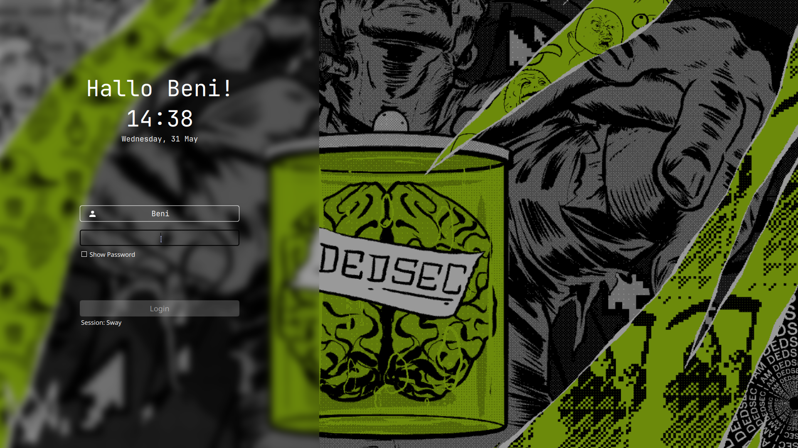
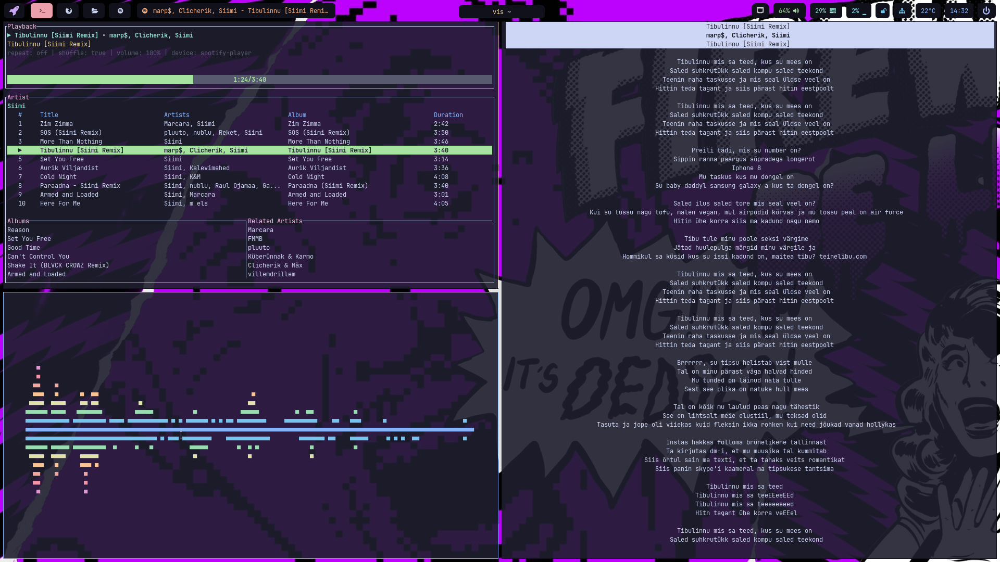
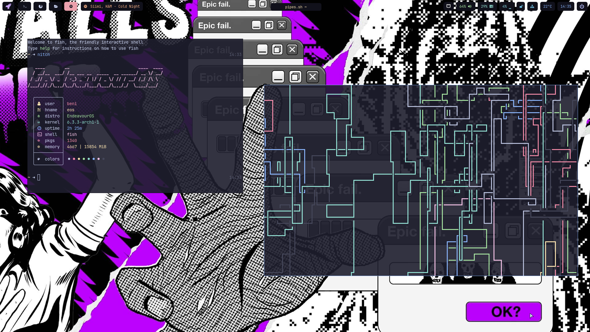

# no-pizza-hawaii dotfiles

- **OS**: [EndeavourOS](https://endeavouros.com/)
- **WM**: [sway](https://github.com/EndeavourOS-Community-Editions/sway)
- **Term**: [foot](https://github.com/DanteAlighierin/foot)
- **Shell**: [fish](https://fishshell.com/)
- **Editor**: [AstroVIM](https://github.com/AstroNvim/AstroNvim)
- **Bar**: [waybar](https://github.com/Alexays/Waybar)
- **System Fetch**: [nitch](https://github.com/ssleert/nitch)
- **System Monitor**: [bottom](https://github.com/ClementTsang/bottom)
- **Browser**: [firefox](https://www.mozilla.org/en-US/firefox/new/)
- **Login**: SDDM [Sugar-Candy Theme](https://github.com/Kangie/sddm-sugar-candy)
- **Screen Lock**: [swaylock-effects](https://github.com/mortie/swaylock-effects)
- **File Explorer**: thunar
- **Image Viewer**: imv
- **PDF Viewer**: okular
- **Spotify Skin**: [spicetify](https://github.com/spicetify) [Sleek Deep Theme](https://github.com/spicetify/spicetify-themes/tree/master/Sleek) / [spotify-player](https://github.com/aome510/spotify-player)
- **RGB**: [OpenRGB](https://openrgb.org/)
- **Music Visualizer**: [vis](https://github.com/dpayne/cli-visualizer) / [cava](https://github.com/karlstav/cava)
- **Lyrics**: [lyrics-in-terminal](https://github.com/Jugran/lyrics-in-terminal)
- **Password Manager**: [bitwarden](https://bitwarden.com/)
- **Color Theme**: [Catpuccin Mocha](https://github.com/catppuccin/catppuccin)
- **Font**: [JetBrains Nerd Font](https://www.jetbrains.com/lp/mono/)
- **Clipboard Manager**: [clipman](https://github.com/yory8/clipman)
- **Screensaver**: [pipes.sh](https://github.com/pipeseroni/pipes.sh)
- **Background**: Ubisoft's WatchDogs Dedsec

Most scripts are not mine but from EOS Community or other dotfiles.

## Screenshots

